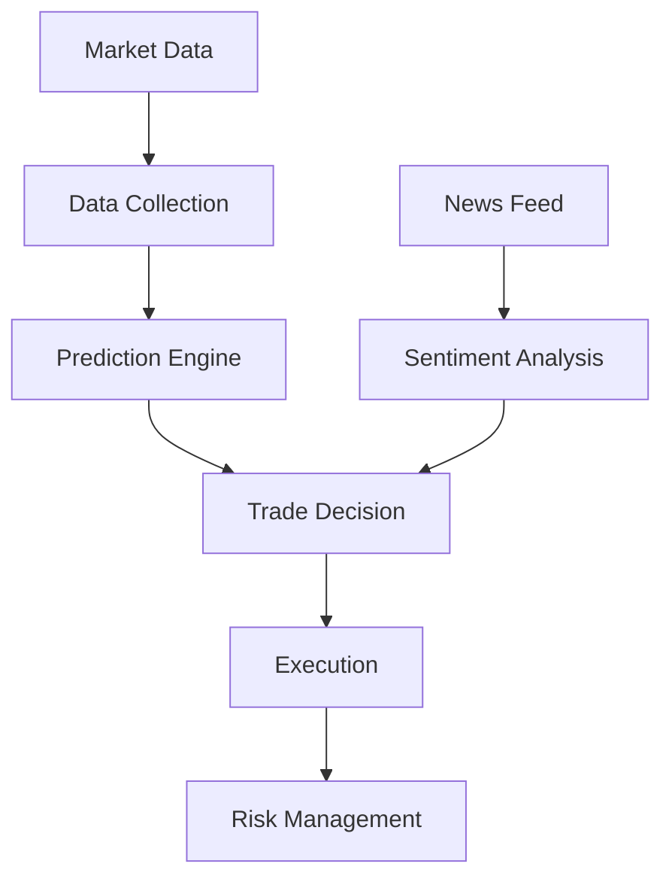

# 🚀 Banckof - AI Stock Trading Platform

<div align="center">
  
  <br/><br/>
  <a href="LICENSE">
    
  </a>
  <a href="https://www.python.org/">
    
  </a>
  <a href="https://github.com/psf/black">
    
  </a>
</div>

---

## 🌟 Key Features

- 📈 **Intelligent Price Prediction**  
  Deep learning models for accurate market forecasting

- 🤖 **Automated Trading**  
  Seamless integration with Alpaca brokerage API

- 📰 **News Sentiment Analysis**  
  Real-time financial news analysis for better decisions

- 🛡️ **Risk Management**  
  Automatic Stop-Loss/Take-Profit calculation

- 📊 **Interactive Dashboard**  
  Real-time market data visualization

---

## 🏗️ System Architecture


##  🗂️ File	📄 Description
```
dashboard.py	Interactive web interface
data_collection.py	Market data collection from Yahoo Finance
deep_learning_model.py	Neural network price prediction
execute_trade.py	Brokerage API connection
news_analysis.py	Financial news sentiment analysis
predict_market.py	Linear regression market prediction
risk_management.py	Risk calculation and management
security.py	Data encryption for sensitive info
trade_scheduler.py	Automated trading scheduler
```
## 🚀 Quick Start
# ✅ Prerequisites
Python 3.8+

Alpaca Paper Trading Account

NewsAPI Key (Optional)

## 📦 Installation
```bash
git clone https://github.com/yourusername/banckof.git
cd banckof
pip install -r requirements.txt
```

#🔑 API Keys in execute_trade.py:
```python
API_KEY = 'your_api_key_here'
API_SECRET = 'your_api_secret_here'
```
#📰 (Optional) NewsAPI in news_analysis.py:
```python
NEWS_API_KEY = 'your_newsapi_key_here'
```
#▶️ Run the App
```bash
python dashboard.py
```
Visit the dashboard at: http://localhost:8050


